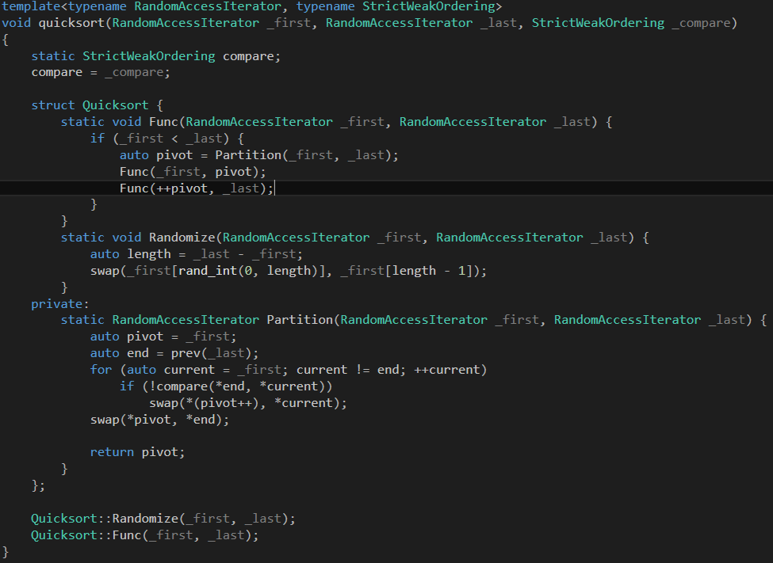

This is a C++ library that aims to provide algorithms, data structures and meta-programming solutions as Standard Template Library does.

Map based on AVL tree

Set based on AVL tree

Quicksort

Metaprogramming

BitManipulation

